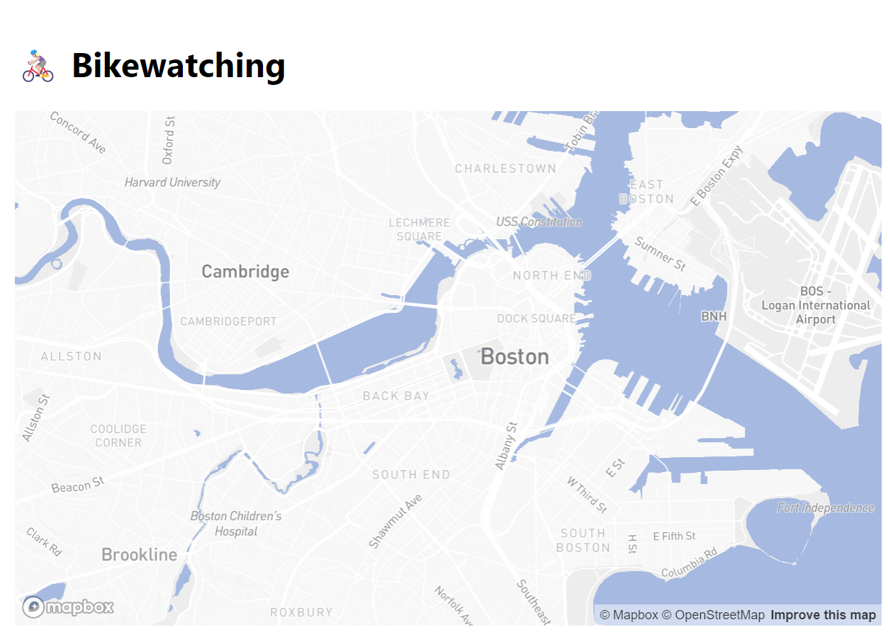
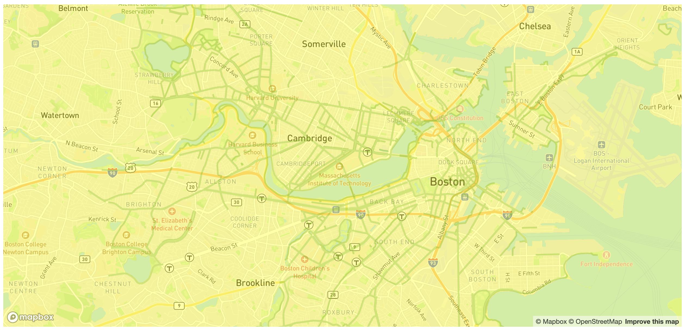
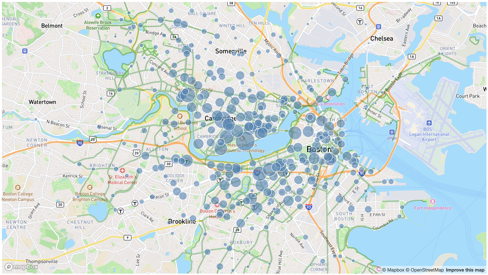

# Notes
Follows from [svelte-porfolio](https://github.com/ccalobeto/svelte-portfolio/).

# Table of contents

# Lab 8: Geospatial visualizations
## 8.0 Setup
Create a project folling these [steps](https://github.com/ccalobeto/svelte-portfolio/blob/main/README.md#lab-4-svelte-templating--control-flow)

Publish your project

Add some content to your `routes/+page.svelte`

Add some basic styling

Add a custom favicon and a title

## 8.1: My first map
### 8.1.0: Setup Mapbox Tool
Create a mapbox account.

Install mapbox utility.

```
npm install mapbox-gl
```

Add a `<div id="map" />` element to hold the map.

Import mapboxgl and connect it to your account. Make a .env file to protect your token. It must start with VITE_ prefix to be imported by `import.meta.env`.

### 8.1.4: Create the map
Create a map object using `mapboxgl.Map` with settings like: container HTML-element, basemap, center-coordinates and zoom.

Use `onMount` to display the map in the browser.

See dev tools what are the elements added by mapbox.


### 8.1.5: Customizing the map (optional)
Using mapbox studio to create your own *map style*.

Select a styles, publish in your account, get the style URL (something like 'mapbox://styles/casillasenrique/clukyyerk007v01pb6r107k1o') and place it in your map object in your project.



## 8.2: Adding bike lanes
Adding **layer** to our map

### 8.2.1: Import the data
Adding bike lanes of Boston **layer** to our map.

Use `addSource` method to connect the map to an external data. But first you have to wait for the `"load"` event to fire on `map`. So,

Convert `onMount` function to an `async` function

Add the load event

Add the `map.addSource` method

(optional) If you want use pre-charged data: 

Create an async function outside `onMount`
```js
async function loadGeoJSON() {
    const response = await fetch('path/to/your/geojson.geojson');
    const data = await response.json();
    return data;
  }
```
Then load geojson data 
```js
onMount(async() => { 
  ...
  const geojson = await loadGeoJSON();
  map.addSource('my-source', {
      type: 'geojson',
      data: geojson
    });
  ...
})
```

## 8.2.2: Drawing bike lanes on the map
(Styling is 8.2.3)

Add a layer to our map with `map.addLayer`, style it in *paint* property.


## 8.2.4: Adding Cambridge bike lanes
Adding bike lanes of Cambridge **layer** to our map.

## 8.3: Adding bike stations

We will add this data `https://vis-society.github.io/labs/8/data/bluebikes-stations.csv` to our map. 

### 8.3.1 Fetching and parsing the CSV
Load stations data using d3.csv

### 8.3.2: Overlaying SVG on the map

Append an `svg` element to our `div` container. In dev tools you will see a smaller `svg` element

Style `svg` element.

Remove [background]() and [opacity](), they were just for debugging.



### 8.3.3: Adding station markers
Here we will append a bunch of circles to the SVG element, each representing a station.

Move variables (map and stations) out of `onMounth()` callback so that they are visible to the HTML template too.

Create a `getCoordinates()` helper function to obtain the center of circle, which inside use a built-in function `map.project()` that returns the map coordinates in pixels.

Then use {#each} block to loop over the stations and append `<circle>` elements


### 8.3.4: Adjusting station markers when map is zoomed/panned

The map breaks down if we try to span, zoom or rotate. Here we will fix it!

Video
<video src="./static/images/8-fix-station-zooming-splatters.mp4" autoplay muted loop></video>

Svelte's reactivity is not working as expected because zooming and panning changed too. These side effects (dependencies that are not visible in the code), we need to take care of updating the state ourselves. 

So <u>move</u> fires an event when a map is moved(panned, zoomed, rotated etc). Use in combination with `mapViewChanged` variable to count it. 

Finally use {#key} block to force a re-render when a varible changes.

> The last suggestion could be resolved giving `mapViewChanged` as a dummy parameter to `getCoordinates()`, but it will be look like a *hack* when it is intentional. It also means it could break in the future if Svelte becomes smarter about detecting dependencies.

Video
<video src="./static/images/8-fix-panning.mp4" autoplay muted loop></video>

## 8.4: Visualizing bike traffic
Set the size of the circles according the amount of traffic at each station

### 8.4.1: Importing and parsing the traffic data
Fetch  'https://vis-society.github.io/labs/8/data/bluebikes-traffic-2024-03.csv' and call it `trips`.

### 8.4.2: Calculating traffic at each station

Use `d3.rollup()` to calculate arrivals, departures and total traffic to each station.

Then add this properties to each station.

### 8.4.3: Size markers according to traffic

Adjust the radius of the circles to the total traffic.

Style the circle for a better view.



### 8.4.4: Adding a tooltip with exact traffic numbers (optional)
Build a simple tooltip with title and add `pointer-events: auto` to our CSS rule for circle to recover displaying in the circles.

