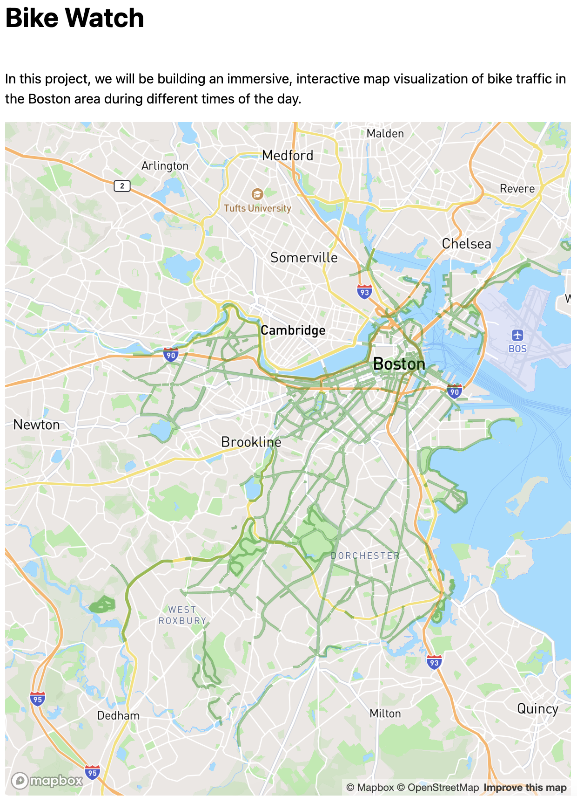

# Notes
Follows from [svelte-porfolio](https://github.com/ccalobeto/svelte-portfolio/).

# Table of contents

# Lab 8: Geospatial visualizations
## 8.0 Setup
Create a project folling these [steps](https://github.com/ccalobeto/svelte-portfolio/blob/main/README.md#lab-4-svelte-templating--control-flow)

Publish your project

Add some content to your `routes/+page.svelte`

Add some basic styling

Add a custom favicon and a title

## 8.1: My first map
### 8.1.0: Setup Mapbox Tool
Create a mapbox account.

Install mapbox utility.

```
npm install mapbox-gl
```

Add a `<div id="map" />` element to hold the map.

Import mapboxgl and connect it to your account. Make a .env file to protect your token. It must start with VITE_ prefix to be imported by `import.meta.env`.

### 8.1.4: Create the map
Create a map object using `mapboxgl.Map` with settings like: container HTML-element, basemap, center-coordinates and zoom.

Use `onMount` to display the map in the browser.

See dev tools what are the elements added by mapbox.


### 8.1.5: Customizing the map (optional)
Using mapbox studio to create your own *map style*.

Select a styles, publish in your account, get the style URL (something like 'mapbox://styles/casillasenrique/clukyyerk007v01pb6r107k1o') and place it in your map object in your project.


## 8.2: Adding bike lanes
Adding bike lanes of Boston **layer** to our map

### 8.2.1: Import the data

Use `addSource` method to connect the map to an external data. But first you have to wait for the `"load"` event to fire on `map`. So,

Convert `onMount` function to an `async` function

Add the load event

Add the `map.addSource` method

(optional) If you want use pre-charged data: 

Create an async function outside `onMount`
```js
async function loadGeoJSON() {
    const response = await fetch('path/to/your/geojson.geojson');
    const data = await response.json();
    return data;
  }
```
Then load geojson data 
```js
onMount(async() => { 
  ...
  const geojson = await loadGeoJSON();
  map.addSource('my-source', {
      type: 'geojson',
      data: geojson
    });
  ...
})
```

## 8.2.2: Drawing bike lanes on the map
(Styling is 8.2.3)

Add a layer to our map with `map.addLayer`, style it in *paint* property.



## 8.2.4: Adding Cambridge bike lanes
Adding bike lanes of Cambridge **layer** to our map.
